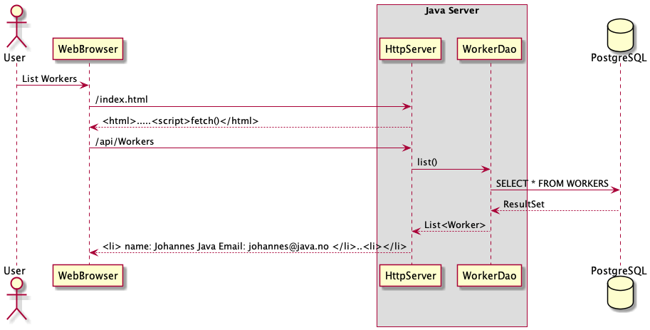

# pgr203eksamen

Parprog Film : https://screencast-o-matic.com/watch/cYXho6Mj2U

<h2>Description for this project:</h2>

This project is a exam in PGR203 (Advanced Java).
The project itself is a Webserver that's let you create workers with first name, last name and Email.  .
you can also Creat tasks for Workers, everything is simple in the http://localhost:8080/index.html that's guid you to the different pages.

The project is running on Maven-sunfire-plugin version 2.22.2, Maven compiler plugin 3.8.1 and junit-jupiter 5.6.2.    

<h2>How to run this web-server:</h2>

Clone repository into IntelliJ (if you dont have IntelliJ installed, click <a href="https://www.jetbrains.com/idea/download">here</a> to go to the Jetbrains site)

You should open your terminal and run the command: "sudo mvn package" in the folder. This will make a executable JAR file.

If this doesn't work, open the Maven tab in the project and find HttpClient/Lifecycle and then press "package".

 

 Then run the command "java -jar target/...jar", this will start up a webserver. 

203eksamen-1.0-SNAPSHOT.jar

